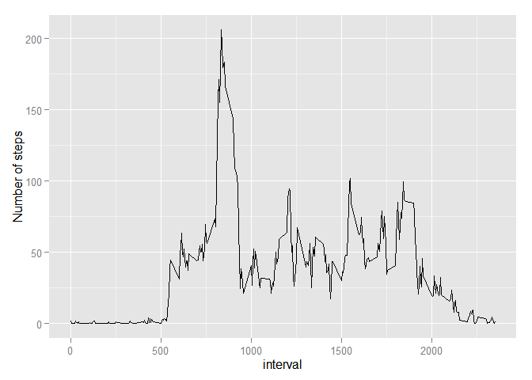

# Reproducible Research: Peer Assessment 1


## Loading and preprocessing the data

```r
activity<-read.csv(file=unz("activity.zip","activity.csv"),header = TRUE)
activity$date<-as.Date(activity$date)
```

## What is mean total number of steps taken per day?

```r
#total number of steps per day
total_steps_day<-aggregate(activity$steps,by=list(date=activity$date),FUN = sum,na.rm=TRUE)

#histogram
hist(total_steps_day$x,xlab = 'Total Number of steps', main = 'Histogram of Total Steps per day')
```

 

```r
#mean of total num of steps taken per day
mn<-mean(total_steps_day$x,na.rm = TRUE)
med<-median(total_steps_day$x,na.rm = TRUE)
```
Mean of total number of steps taken per day = 9354  
Median of total number of steps taken per day = 10395

## What is the average daily activity pattern?

```r
library(ggplot2)
```

```
## Warning: package 'ggplot2' was built under R version 3.1.3
```

```r
avg_steps_interval<-aggregate(activity$steps,by=list(interval=activity$interval),FUN = mean,na.rm=TRUE)
ggplot(data = avg_steps_interval,aes(x=interval,y=x))+geom_line()+ylab('Number of steps')
```

 

```r
max_steps_interval<-subset(avg_steps_interval,avg_steps_interval$x==max(avg_steps_interval$x))
```
The 5-minute interval, on average across all the days in the dataset, that contains the maximum number of steps: 835


## Imputing missing values

```r
#num of na's
miss<-sum(is.na(activity))

#left join activity and avg_steps_interval 
activity_merge<-merge(x = activity,y = avg_steps_interval,by = "interval",all.x = TRUE )

#if steps is na, replace with corresponding mean step for that interval
activity_merge$steps<-ifelse(is.na(activity_merge$steps),activity_merge$x,activity_merge$steps)
#remove the mean steps column
activity_imput<-activity_merge[,-4]

total_steps_day_imput<-aggregate(activity_imput$steps,by=list(date=activity_imput$date),FUN = sum,na.rm=TRUE)
#histogram
hist(total_steps_day_imput$x,xlab = 'Total number of steps per day',main = 'Histogram of total steps per day with imputted data' )
```

 

```r
#mean of total num of steps taken per day
mn_imput<-round(mean(total_steps_day_imput$x),0)
med_imput<-median(total_steps_day_imput$x)
```
Total number rows with missing values = 2304 

Mean of total number of steps taken per day (imputted) = 1.0766\times 10^{4}  
Median of total number of steps taken per day (imputted)= 1.0766\times 10^{4}

After imputing the missing values, both the mean and median values of total number of steps taken increased.


## Are there differences in activity patterns between weekdays and weekends?


```r
#weekday or weekend
days<-ifelse(test = weekdays(activity$date)=="Sunday"|weekdays(activity$date)=="Saturday","weekend","weekday")

activity_days<-cbind(activity,days)

avg_steps_interval_days<-aggregate(activity_days$steps,by=list(interval=activity_days$interval,days=activity_days$days),FUN = mean,na.rm=TRUE)

 qplot(x=interval, y=x, data=avg_steps_interval_days, geom="line",ylab = 'Number of Steps') + facet_grid(days ~ .)
```

 

From the above plot, it is clear that there is some difference in activity patterns between weekdays and weekends. It is seen that activity starts around interval 500 in weekdays, whereas activity starts around interval 800 on the weekends. 
